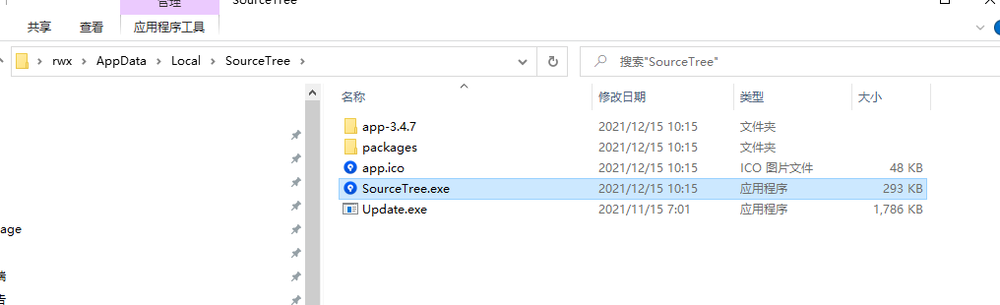
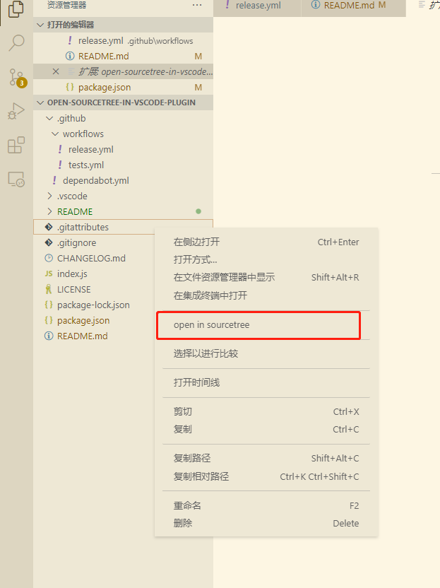
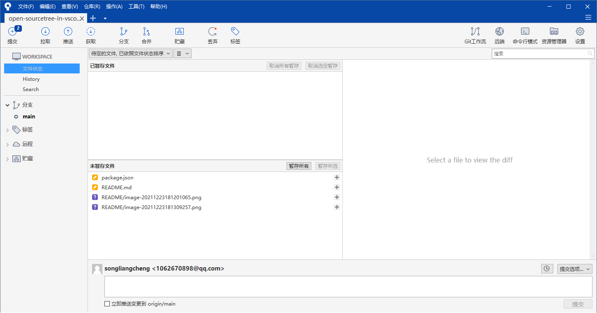

# open-sourcetree-in-vscode-plugin

在vscode中的资源管理器中，直接右键可以打开sourcetree, 并加载当前git源码树到sourcetree

# 使用方法
先定位sourcetree的安装目录

之后将此目录`D:\文档\open-sourcetree-in-vscode-plugin`加载到系统环境变量中。

# 调用sourcetree

vscode中的资源管理器

现在将直接在sourcetree中打开此源码仓库

